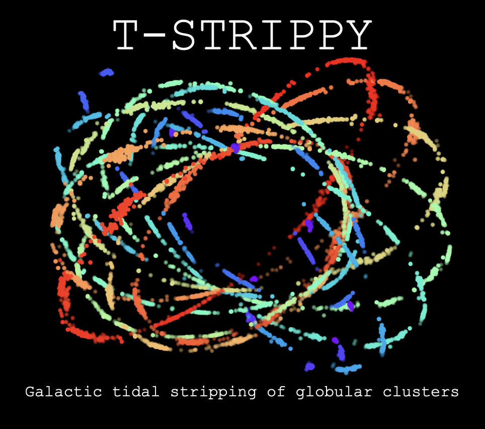

# TSTRIPPY
## TIDAL-STRIPING-PYTHON



TSTRIPPY is a Python/Fortran package for tidal stripping simulations in Milky Way potentials.
Huge thanks to @JoBovy's [python packaging guide](https://pythonpackaging.info/) and GitHub Copilot for helping with Fortran packaging workflows.


- Tested on Linux systems
- Started in Jan 2024. 
- Compatible with Python 3.9 to 3.11 using meson build system
- Cross-platform build via meson

## Requirements

* Python 3.9 to 3.11
* gfortran 11+ (or compatible Fortran compiler)
* The following Python packages (installed automatically):
  * NumPy 1.20+
  * Astropy 4.0+
  * PyYAML 5.1+

## Installation

```bash
conda env create -f environment.yml
conda activate tstrippy
```

Now build the package

``` bash
meson setup builddir
meson compile -C builddir/
meson install -C builddir/
```

Or use the helper script:

```bash
./build.sh
```

## Verify Installation

```bash
python -c "import tstrippy; print(tstrippy.__file__)"
```

## Documentation

The docs are hosted at <https://tstrippy.readthedocs.io>.