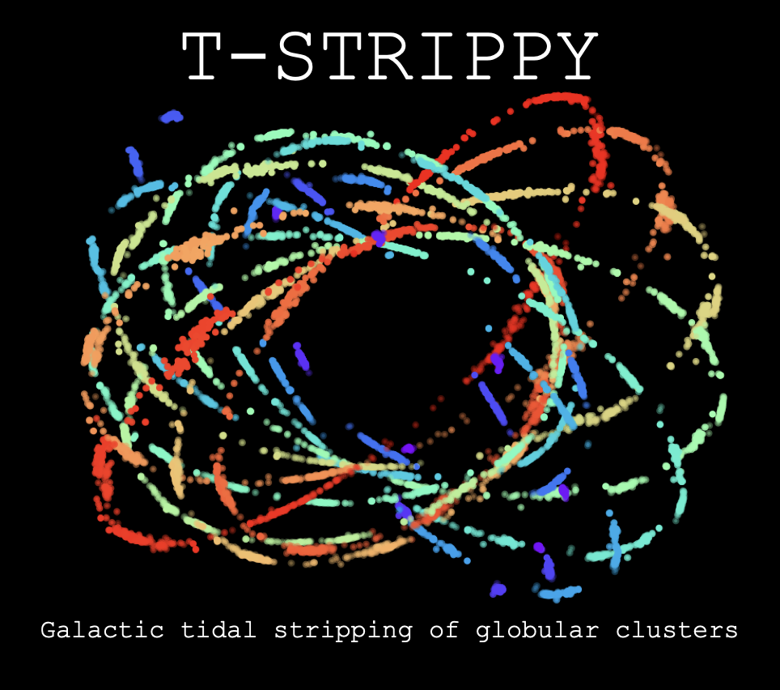

# TSTRIPPY
## TIDAL-STRIPING-PYTHON



Not quite ready yet, but its getting there. Huge thanks to @JoBovy's [python packaging guide](https://pythonpackaging.info/) and GitHub's Co-Pilot for teaching me how to incorporate Fortran dependencies. 


- Tested on Linux systems
- Started in Jan 2024. 
- Compatible with Python 3.12 using meson build system
- Cross-platform build via meson

## Requirements

* Python 3.9+
* gfortran 11+ (or compatible Fortran compiler)
* The following Python packages (installed automatically):
  * NumPy 1.20+
  * Astropy 4.0+
  * PyYAML 5.1+

## Installation
```bash
    conda env create -f environment.yml
    conda activate tstrippy
```
Now build the package
``` bash
    meson setup builddir
    meson compile -C builddir/
    meson install  -C builddir/
```

NOTES:
The documentation on `tstrippy.readthedocs.io` is going well. I want to be able to compile the code on readthedoc's computer. 


Compilation notes. 
The trouble seems to never end, particularly with the mac processors. I have needed to delete miniconda and switch to miniforce in order to ensure that I am suing the arm64 processors
```
curl -L -O https://github.com/conda-forge/miniforge/releases/latest/download/Miniforge3-MacOSX-arm64.sh
```
Hitherto this, I would have some success. However, I updated one conda environment to use plotly and then 